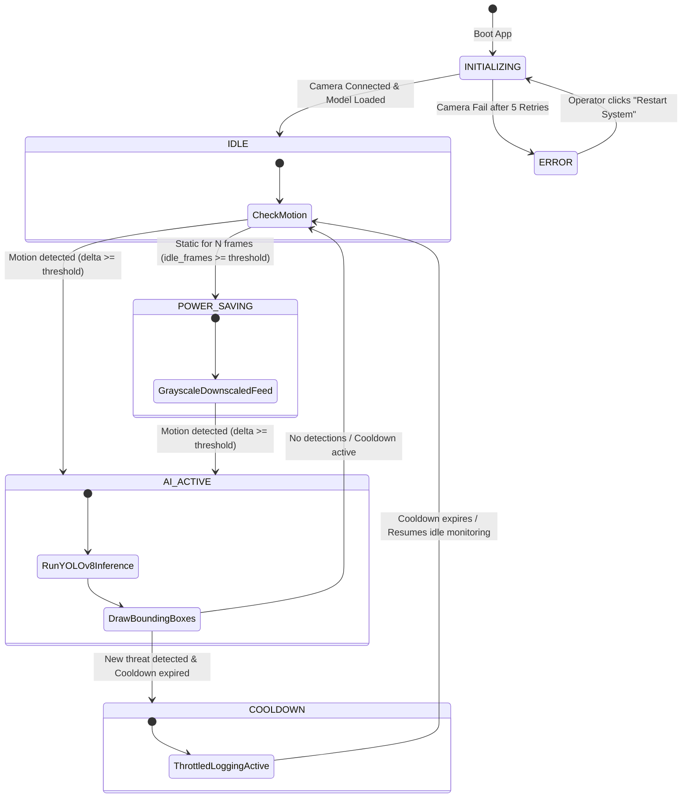

# 🛡️ NeuroGuard: Event-Driven Smart Surveillance
> An edge-deployable, neuromorphic AI surveillance system inspired by the spiking behavior of biological neurons in the human visual cortex.

NeuroGuard fundamentally reconceives edge computer vision. Instead of running expensive YOLOv8 object detection on every frame—which consumes 100% CPU and causes thermal throttling on edge devices—NeuroGuard operates a **dendritic sensory layer** to monitor for motion, keeping the **heavy AI inference core dormant** until a meaningful environmental stimulus triggers its activation.

---

## 🧠 The Neuromorphic Architecture

NeuroGuard maps the physiological principles of a biological neuron directly to software constructs:

| Biological Concept | Software Translation | Technical Implementation |
| :--- | :--- | :--- |
| **Dendritic Sensory Inputs** | Frame Difference Engine | Lightweight OpenCV grayscaling, Gaussian blurring, and pixel subtraction (`cv2.absdiff`) requiring only `~2–5%` CPU. |
| **Resting Membrane Potential** | Power Saving / Sleep State | Grayscale, downscaled frame buffer with zero YOLOv8 activations when the scene is static. |
| **Action Potential Threshold** | Motion Delta Trigger | An environmental trigger that fires when the mean absolute pixel difference between frames exceeds a user-configured threshold (`delta_mean >= delta_threshold`). |
| **Downstream Neural Pathway** | YOLOv8 Inference Activation | The YOLOv8 nano model is activated to analyze the triggering frame and extract specific object classes (e.g. `person`, `car`, `suitcase`). |
| **Synaptic Weight Reinforcement** | Loitering Escalation Engine | Increments loitering counters by tracking spatial centroids of targets across frames, escalating threat alerts if presence persists. |
| **Refractory Period** | Logging Cooldown State | Suppresses redundant database writes, snapshot disk I/O, and audio alerts for a configurable duration (`cooldown_duration`), while keeping the on-screen bounding boxes updating in real-time. |

---

## 📊 Finite State Machine (FSM)

The system governs transitions between states to maximize computation reduction:



---

## 🛠️ Minute Technical Details & Logic

### 1. Sensory Motion Engine
* **Noise Suppression:** Grayscale frames are passed through a `21x21` Gaussian filter to eliminate high-frequency thermal sensor noise.
* **Delta Computation:** Computed as the mean value of `cv2.absdiff(prev_frame, curr_frame)`. If this mean delta exceeds `delta_threshold` (slider-tunable from `5` to `80`), motion is detected.
* **Dynamic Resolution Switching:** In `POWER_SAVING` mode, frames are downscaled by 50% (`fx=0.5, fy=0.5`) to minimize compute. When transitioning back to full computation mode, the engine dynamically resizes the previous frame buffer (`prev_frame`) to match the new incoming frame shape using `cv2.INTER_AREA` interpolation, preventing dimension mismatch crashes.

### 2. Dual-Layer Bounding Box Inference
* **Primary AI Inference:** Executes Ultralytics YOLOv8 nano (`yolov8n.pt`) on the full-resolution frame. Bounding box coordinates, confidence scores, and threat levels are parsed from the tensor output.
* **Fallback Motion Contours:** If the YOLOv8 model detects no objects, the system automatically runs a contour-based motion detector (`cv2.findContours` + bounding boxes scaled back to the original resolution) around the moving areas. This ensures that **bounding boxes are always displayed on-screen when motion is present**, providing immediate visual feedback to the operator even if YOLO does not recognize the object.

### 3. Loitering & Threat Escalation
The engine tracks objects of class `person` and `suitcase` across consecutive active frames by computing the Euclidean distance between bounding box centroids.
* **Proximity Threshold:** If a centroid is detected within `150 pixels` of a previous track, it is associated with the same target.
* **Person Escalation:** A detected `person` starts as a `MEDIUM` threat. If they loiter for `>= 15 seconds`, they escalate to `HIGH` threat. If they loiter for `>= 30 seconds`, they escalate to `HIGH` threat regardless of base threat.
* **Suitcase (Unattended Luggage) Protocol:** A detected `suitcase` starts as a `MEDIUM` threat. If it loiters/remains stationary for `>= 60 seconds`, the threat escalates to `HIGH`.

---

## 🖥️ Streamlit Multi-Page Operator UI

The application features a dark-themed, glassmorphic layout separated into four pages:

1. **Dashboard (`Dashboard.py`):** Real-time preview of the camera feed, system resource utilization indicators (CPU and RAM via `psutil`), computation reduction gauges, and a summary of recent events.
2. **Live Monitoring (`pages/2_Live-monitoring.py`):** A dedicated live stream feed updating in real-time, showing running frame deltas, active FSM status, and immediate threat alerts.
3. **Alerts (`pages/3_Alerts.py`):** High-level summary of threat counts (High, Medium, Low) and a list of captured timestamped snapshots with download options.
4. **Reports (`pages/4_Reports.py`):** Interactive analytical charts displaying threat distributions and inference processing latency trends, plus an option to export the event logs to a CSV file (`events_YYYYMMDD_HHMMSS.csv`).

---

## 🚀 Local Installation & Execution

Follow these steps to run the project locally on your machine:

### Prerequisites
* Python 3.10 or 3.11 installed.
* A connected USB webcam or built-in camera.

### Step 1: Clone the Repository
Open your terminal and navigate to the project directory:
```bash
git clone https://github.com/parthpanchal-7/NeuroGuard-Sythron.git
cd NeuroGuard-Sythron
```

### Step 2: Create a Virtual Environment
Create and activate a local Python virtual environment to isolate dependencies:
```bash
# Windows
python -m venv venv
venv\Scripts\activate

# macOS/Linux
python3 -m venv venv
source venv/bin/activate
```

### Step 3: Install Dependencies
Install the required packages:
```bash
pip install -r requirements.txt
```
> [!NOTE]
> The first time the application runs, it will check for the YOLOv8 nano weight file `models/yolov8n.pt`. If not present, the `ultralytics` library will automatically download the pretrained COCO weights and save them locally.

### Step 4: Run the Application
Start the Streamlit server:
```bash
streamlit run Dashboard.py
```
After launching, your web browser will automatically open the dashboard at `http://localhost:8501`.

---

## ⚙️ System Tuning & Adjustments

You can tune the system’s performance directly from the Streamlit sidebar:
* **Motion sensitivity:** Decreasing this value makes the system trigger on smaller movements (useful in low-light). Increasing it suppresses false triggers from environmental factors (e.g. swaying trees).
* **Cooldown seconds:** Determines how long the system suppresses writing duplicate alerts/snapshots to disk. Bounding boxes will still render, but no log spam will occur.
* **Min contour area:** Adjusts the minimum region size required for fallback motion contour boxes.
* **Audio Alerts:** Check the "Enable alert beep" option to trigger a speaker beep on your system whenever a `MEDIUM` or `HIGH` threat is detected.
